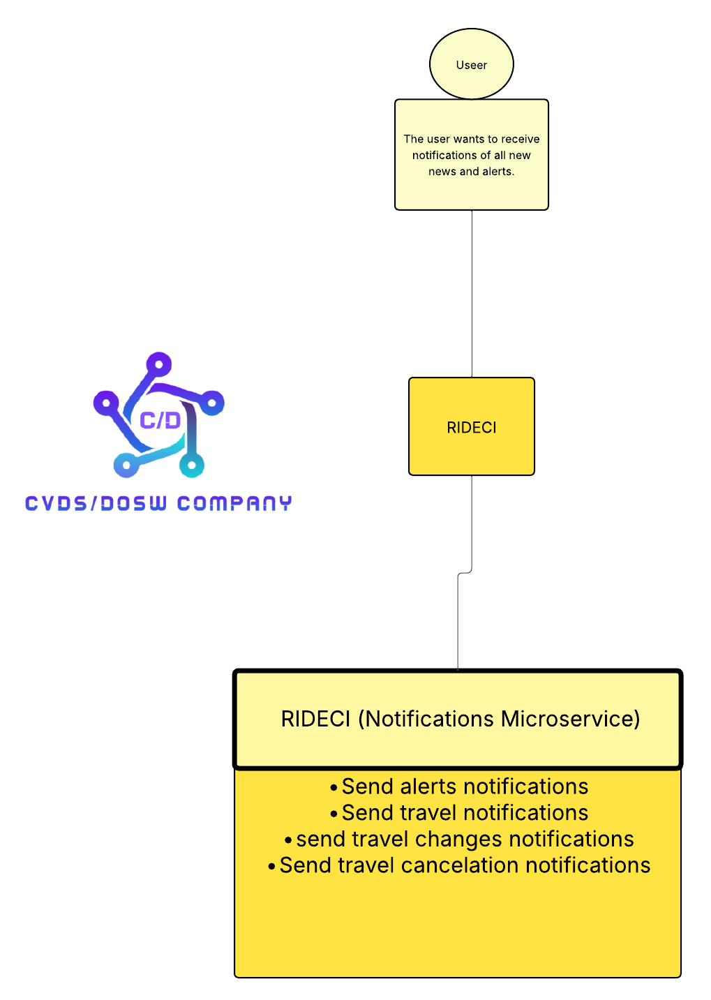
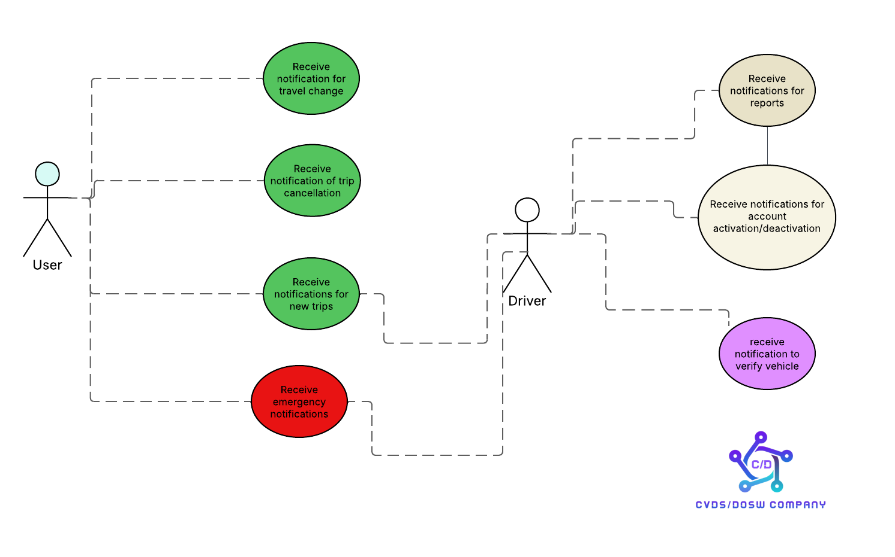
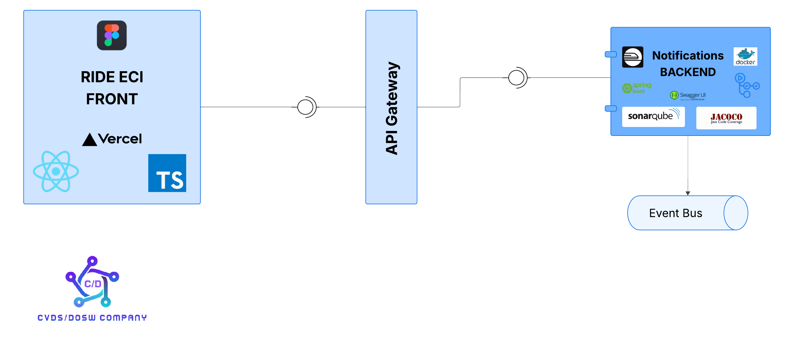
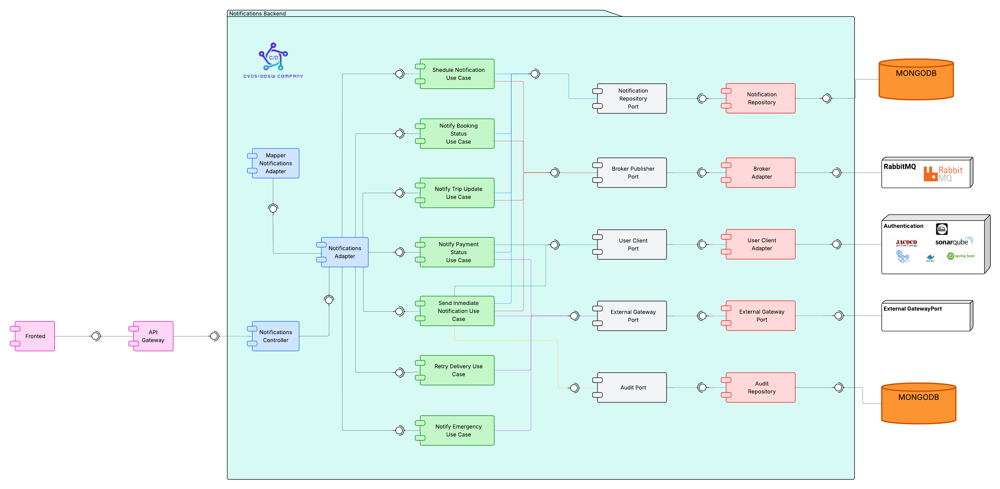
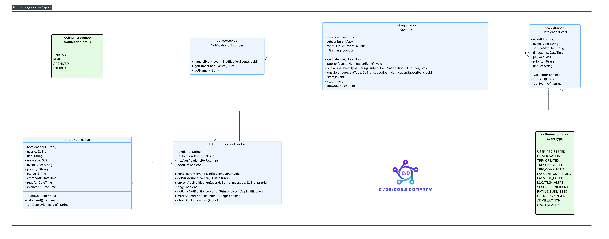
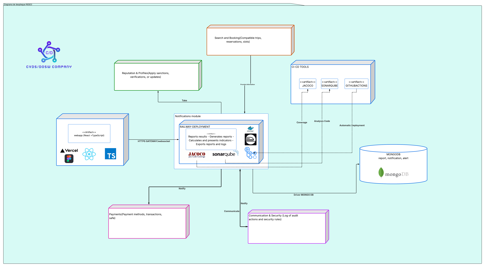

# ATENEA_NOTIFICATIONS_BACKEND

Microservicio de notificaciones y alertas

**Integrantes:**

- Raquel Iveth Selma Alaya
- Nestor David Lopez Castañeda
- Juan Pablo Nieto Cortes
- Carlos David Astudillo Castiblanco
- Robinson Steven Nuñez Portela

---

**Descripción:**

Brinda herramientas para generar, visualizar y distribuir informes institucionales y 
notificaciones automáticas de seguridad, estado, estadísticas y sostenibilidad.

---

## Tabla de Contenidos:

- [Carateristicas](#caracteristicas)
- [Estrategia de Versionamiento y ramas](#estrategia-de-versionamiento-y-ramas)
- [Tecnologías utilizadas](#tecnologías-utilizadas)
- [Estructura del Proyecto](#estructura-del-proyecto)
- [Diagramas](#diagramas)
- [Configuracion Base de Datos MongoDB](#configuracion-base-de-datos-mongodb)
- [DOCKERIZACIÓN DE LA APPI](#dockerización-de-la-appi)
- [Despliegue Api Kubernets](#despliegue-api-kubernets)
- [Despliegue Railway y configuración Ambientes de pruebas](#despliegue-railway-y-configuración-ambientes-de-pruebas)
- [Pruebas Ejecución de Ambientes](#pruebas-ejecución-de-ambientes)
- [Pruebas de PostMan](#pruebas-de-postman)
- [Configuración y Prueba de Seguridad SSL](#configuración-y-prueba-de-seguridad-ssl)
- [Compilación del Proyecto](#compilación-del-proyecto)
- [Evidencia JaCoCo](#evidencia-jacoco)
- [Evidencia SonarQube](#evidencia-sonarqube)

---

## Caracteristicas:

- Notifica resultados de revisión.
- Genera reportes por viaje y usuario
- Envía notificaciones a usuarios e institución
- Calcula y presenta indicadores visuales
- Exporta informes y logs

---

## Estrategia de Versionamiento y ramas

- main: Versión estable para PREPROD
- develop: Rama principal de desarrollo
- bugix/*: Manejo de errores
- release/*: Manejo de versiones.

---

**Template Commits:**

`feature: Tarea - Acción Realizada`

---

## Tecnologías utilizadas:

- MongoBD
- Railway
- Vercel
- Java 17
- TypeScript
- Jacoco
- SonarQube
- Swagger UI
- Docker
- Sprint Boot
- Maven
- Kubernetes k8
- GitHub Actions
- Postman
- Figma
- Slack
- Jira
- JWT
- Postgresql


---


## Estructura del Proyecto


Este proyecto implementa Arquitectura Limpia (Clean Architecture),
organizando el código en capas independientes que separan la lógica de negocio de los detalles técnicos.

```bash
src/
├── main/
│   ├── java/edu/dosw/rideci/
│   │   ├── domain/         # CAPA DE DOMINIO
│   │   ├── application/    # CAPA DE APLICACIÓN
│   │   └── infrastructure/ # CAPA DE INFRAESTRUCTURA
│   └── resources/
└── test/
```

### Arquitectura Limpia


**DOMAIN (Dominio):**

Representa el núcleo del negocio y contiene los conceptos más importantes de la aplicación. En esta capa se define qué hace el sistema, no cómo lo hace.

**Contiene:**

**Entities:** Clases que representan los objetos principales del negocio y sus invariantes.

**Value Objects:** Objetos de valor que encapsulan reglas específicas (como Email).

**Enums:** Enumeraciones propias del dominio (por ejemplo: tipo usuario, tipo de pago).

**Repositories (interfaces):** Contratos abstractos que definen cómo se accederá a los datos sin depender de una base concreta.

**Services:** Reglas de negocio que involucran múltiples entidades o procesos complejos.

**Events:** Eventos que representan sucesos importantes dentro del dominio (por ejemplo: enviar alerta)


--- 

**APPLICATION (Aplicación):**

Encapsula la lógica de aplicación y los casos de uso. Define cómo se usa el dominio para resolver un problema o ejecutar una acción.

**Contiene:**

**Use Cases:** Casos de uso que orquestan el flujo de la aplicación.

**DTOs (Data Transfer Objects):** Objetos de transferencia de datos usados entre las capas.

**Mappers:** Convertidores entre entidades y DTOs.

**Exceptions:** Excepciones personalizadas que representan errores del negocio o de la aplicación.

---


**INFRASTRUCTURE (Infraestructura):**

Implementa los detalles técnicos que permiten que el sistema funcione. Aquí se manejan aspectos de persistencia, comunicación externa, seguridad y configuración.

Contiene:

**API / Controllers:** Endpoints REST que reciben las solicitudes del usuario, llaman los casos de uso y devuelven las respuestas.

**Database:** Configuración de la base de datos y sus modelos concretos (por ejemplo, anotaciones de JPA o documentos de MongoDB).

**Repositories:** Implementaciones concretas de las interfaces del dominio.

**Config:** Clases de configuración general del sistema (CORS, beans, seguridad, etc.).

---

## Flujo de una Petición

```bash
1. Cliente envía petición HTTP
   ↓
2. Controller (Infrastructure) - Recibe y valida
   ↓
3. Use Case (Application) - Orquesta la lógica
   ↓
4. Domain Service - Ejecuta reglas de negocio
   ↓
5. Repository Interface (Domain) - Contrato de datos
   ↓
6. Repository Implementation (Infrastructure) - Acceso a MongoDB
   ↓
7. Respuesta fluye de vuelta transformándose en cada capa
```

---

## Beneficios de esta Arquitectura

| **Característica**             | **Beneficio**                                                                 |
|--------------------------------|-------------------------------------------------------------------------------|
| **Independencia de Frameworks** | El dominio no depende de Spring, MongoDB o cualquier tecnología específica    |
| **Testabilidad**                | Cada capa puede probarse de forma aislada con *mocks*                        |
| **Mantenibilidad**              | Cambios en la BD o framework no afectan la lógica de negocio                 |
| **Escalabilidad**               | Fácil agregar nuevos casos de uso sin modificar código existente             |
| **Claridad**                    | Responsabilidades bien definidas facilitan la comprensión del código         |


---

# Diagramas

---

## Diagrama de Contexto



---

## Diagrama de Casos de Uso



---

## Diagrama de Componentes General



---

## Diagrama de Componentes Especificos



---

## Diagrama de clases.



---

### Patrones de diseño


---

### Principios SOLID


---

## Diagramas de Secuencia

[DiagramaSecuencia](docs/pdf/DiagramaSecuencias.pdf)

---

## Documento de Arquitectura
[Ver el documento (PDF)](docs/pdf/DocumentoArquitectura.pdf)

---

## Diagrama de Base de Datos


---

## Diagrama de Despliegue



---

## Configuracion Base de Datos MongoDB

[Ver Configuración (PDF)](docs/pdf/BaseMongoDB.pdf)

---

## DOCKERIZACIÓN DE LA APPI

[Ver Configuración de la Dockerización (PDF)](docs/pdf/Dockerizacion.pdf)

---

## Despliegue Api Kubernets

[Ver el reporte (PDF)](docs/pdf/Kubernets.pdf)

---

## Despliegue Railway y configuración Ambientes de pruebas


[Ver el configuracion Ambientes (PDF)](docs/pdf/DespliegueRailway.pdf)


**GitHub Actions:**


**Railway:**


---

## Pruebas Ejecución de Ambientes

(videos)

**SanBox:**

**PREPOD:**

**QA:**

**PRODUCCION:**

---

## Pruebas de PostMan

[Ver Pruebas de videos de Postman en (PDF)](docs/pdf/pruebasEndpoints.pdf)

---

## Configuración y Prueba de Seguridad SSL

[Ver Configuración y prueba (PDF)](docs/pdf/SeguridadSSLPAWPATROL.pdf)


---

## Compilación del Proyecto

---

## Evidencia JaCoCo


---

## Evidencia SonarQube


---

